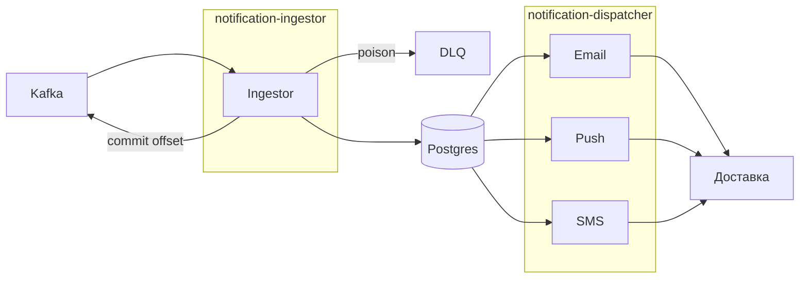
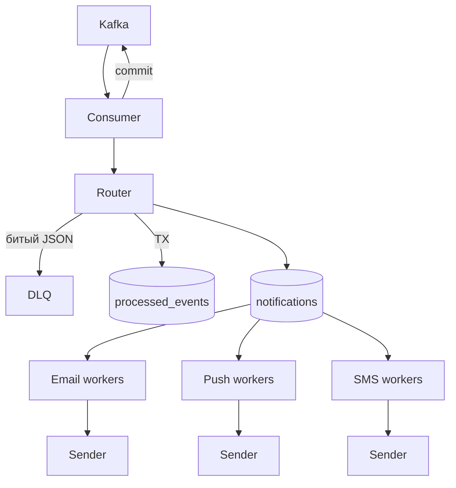
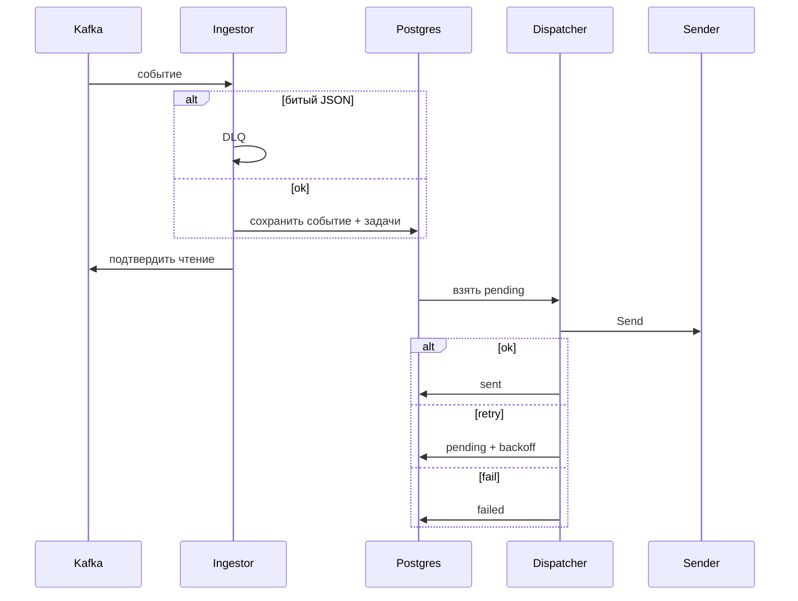
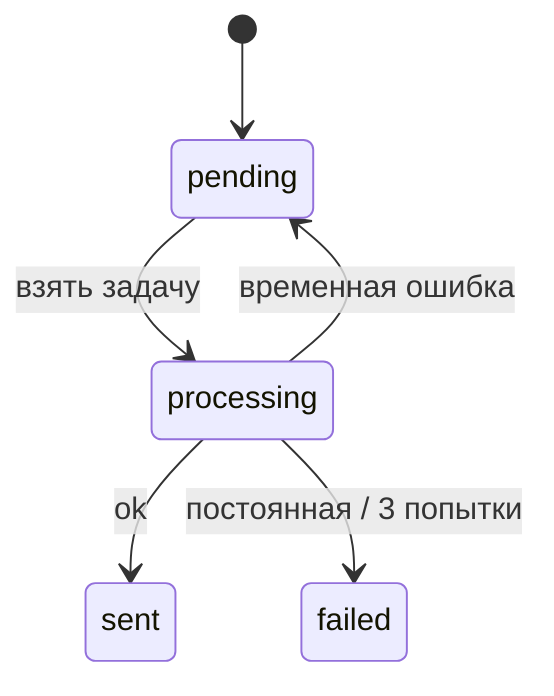

# Solution

## Idea

**notification-processor** — система, которая слушает события пользовательских действий, решает кому
и куда отправить уведомление, и доводит его до доставки с повторами при сбоях.

Система состоит из **2 микросервисов**:

| Сервис                    | Задача                                                                   |
| ------------------------- | ------------------------------------------------------------------------ |
| `notification-ingestor`   | Принять событие, понять какие каналы нужны, сохранить задачи на отправку |
| `notification-dispatcher` | Взять задачи из очереди и отправить по email / push / sms                |

Между сервисами нет прямых вызовов — только общая БД. Ingestor создаёт задачи, dispatcher их
выполняет.

### Как идут данные

```
Событие (Kafka)
    → Ingestor: проверить, определить каналы, сохранить
    → БД: задачи на отправку (pending)
    → Dispatcher: взять задачу → отправить → обновить статус
    → Лог: user_id, event_id, channel
```

### Что делает каждый сервис

**Ingestor**

1. Читает событие из Kafka.
2. Проверяет формат. Битое сообщение — в DLQ, дальше обрабатывает следующие.
3. Смотрит `event_type` и выбирает каналы:
   - `order_created` → email + push
   - `payment_received` → email
   - `order_shipped` → push + sms
4. Сохраняет в БД: «событие обработано» + список уведомлений со статусом `pending`.
5. Подтверждает чтение из Kafka.

**Dispatcher**

1. Периодически читает из БД задачи со статусом `pending`.
2. Берёт задачу, меняет статус на `processing`.
3. Вызывает нужный канал (email / push / sms) — в демо это лог.
4. По результату:
   - успех → `sent`
   - временная ошибка → повтор (до 3 раз, с задержкой)
   - постоянная ошибка → `failed`, больше не пробуем

Email, push и sms работают **независимо**: если sms недоступен, email и push продолжают
отправляться. Ingestor при этом тоже не останавливается.

## Steps

1. Producer пишет события в Kafka (`user-events`).
2. Ingestor читает сообщение из Kafka.
3. Ingestor проверяет JSON.
   - битый / невалидный → в DLQ, подтверждает offset, берёт следующее;
   - ок → идёт дальше.
4. Ingestor по `event_type` выбирает каналы (email / push / sms).
5. Ingestor в одной транзакции пишет в Postgres:
   - Inbox: событие обработано (`event_id`);
   - Outbox: задачи на отправку со статусом `pending`.
6. Ingestor подтверждает чтение (commit offset) в Kafka.
7. Dispatcher забирает `pending`-задачи из Outbox (по каналам независимо).
8. Dispatcher ставит задаче статус `processing`.
9. Dispatcher вызывает Sender нужного канала.
10. Sender пишет лог: кому (`user_id`), какое событие (`event_id`), по какому каналу.
11. Dispatcher обновляет статус в Outbox:
    - успех → `sent`;
    - временная ошибка → снова `pending` + backoff (до 3 попыток);
    - постоянная ошибка / 3-я неудача → `failed`.

## Architecture

**Паттерны:** Bulkhead, Circuit Breaker, Retry+jitter, DLQ, Graceful Shutdown.

### High Level Design



### Границы сервисов

| #   | Сервис                    | Владеет                                                     | Не делает           |
| --- | ------------------------- | ----------------------------------------------------------- | ------------------- |
| 1   | `notification-ingestor`   | чтение Kafka, валидация, routing, запись в БД, DLQ          | отправка, retry     |
| 2   | `notification-dispatcher` | чтение очереди, отправка по каналам, retry, circuit breaker | чтение Kafka, дедуп |

Kafka, Postgres, DLQ — инфраструктура, не сервисы.

Демо: `go run ./cmd/ingestor`, `go run ./cmd/dispatcher`.

### Low Level Design







## Нюансы реализации

### Exactly-once и дедупликация

Событие из Kafka может прийти повторно (рестарт, сбой). Чтобы не отправить уведомление дважды:

1. Ingestor перед созданием задач проверяет `event_id` в таблице **Inbox** (`processed_events`).
2. Если событие уже есть — пропускаем, дубликат не создаём.
3. Новое событие + задачи на отправку пишутся **в одной транзакции**.
4. Только после успешной записи в БД — подтверждаем чтение из Kafka.

Падение между записью в БД и подтверждением Kafka → событие придёт снова → Inbox отсечёт дубликат.
Сообщение не теряется и не дублируется.

### Inbox и Outbox

Две таблицы в Postgres:

**Inbox** (`processed_events`) — какие события уже обработаны.

```sql
event_id UUID PRIMARY KEY
user_id BIGINT NOT NULL
event_type TEXT NOT NULL
created_at TIMESTAMPTZ NOT NULL
```

**Outbox** (`notifications`) — очередь задач на отправку.

```sql
id BIGSERIAL PRIMARY KEY
event_id UUID NOT NULL
user_id BIGINT NOT NULL
channel TEXT NOT NULL              -- email | push | sms
status TEXT NOT NULL               -- pending | processing | sent | failed
attempts INT NOT NULL DEFAULT 0
next_retry_at TIMESTAMPTZ NOT NULL
locked_at TIMESTAMPTZ              -- lease при claim
last_error TEXT
created_at, updated_at TIMESTAMPTZ
UNIQUE (event_id, channel)
```

Ingestor пишет в обе таблицы. Dispatcher только читает и обновляет Outbox.

### Отправка уведомлений

Dispatcher берёт задачи из Outbox (`status = pending`, `next_retry_at <= now()`), по одной на канал.
Несколько воркеров работают параллельно — каждый берёт свою задачу, не блокируя остальных
(`FOR UPDATE SKIP LOCKED`).

Отправка — вызов `Sender` с таймаутом. В демо Sender пишет лог и эмулирует сбои:

- 10% — временная ошибка → retry с backoff (100ms → 200ms → 400ms), макс. 3 попытки
- 1% — постоянная ошибка → `failed` сразу

На каждый канал — свой circuit breaker: если канал массово падает, dispatcher временно перестаёт его
дергать, остальные каналы работают.

### Как избегаем bottlenecks

| Проблема                      | Решение                                                                              |
| ----------------------------- | ------------------------------------------------------------------------------------ |
| SMS завис — всё встало        | Ingestor и dispatcher разделены. Send не в consumer. Каналы изолированы (bulkhead)   |
| Ретраи копятся в памяти       | Retry в БД (`attempts`, `next_retry_at`), не в горутинах. Пул воркеров фиксированный |
| Воркеры блокируют друг друга  | `SKIP LOCKED` — каждый берёт свою строку, без общего mutex                           |
| Битый JSON стопит поток       | Poison pill → DLQ, offset коммитится, следующие сообщения идут                       |
| Процесс убили на `processing` | Lease: через N секунд задача снова `pending`                                         |
| Graceful shutdown             | Ingestor: дождаться TX → commit. Dispatcher: дождаться in-flight Send (~15s)         |

### Каркас репозитория

Монорепо на `go.work`: общие пакеты в `shared`, каждый микросервис — отдельный модуль.

```
notification-processor/
├── go.work
├── docker-compose.yaml              # Postgres + Kafka/Redpanda
├── migrations/
│   └── 00001_init.up.sql            # processed_events (Inbox), notifications (Outbox)
├── shared/                          # общий код
│   ├── go.mod
│   ├── db/
│   │   └── conn.go                  # Postgres pool
│   ├── validation/
│   │   └── validation.go            # валидация структур событий
│   ├── models/
│   │   └── event.go                 # Event, Channel, Notification (DTO)
│   └── store/
│       ├── inbox.go                 # Inbox: дедуп по event_id
│       └── outbox.go                # Outbox: insert / claim / update status
├── notification-ingestor/
│   ├── go.mod
│   ├── cmd/ingestor/main.go         # точка входа, graceful shutdown
│   └── internal/
│       ├── config/config.go         # DSN, brokers, topic, group
│       ├── kafka/consumer.go        # consume + manual commit
│       ├── router/router.go         # event_type → каналы
│       ├── ingest/processor.go      # decode → validate → TX → commit
│       └── dlq/dlq.go               # poison pill
├── notification-dispatcher/
│   ├── go.mod
│   ├── cmd/dispatcher/main.go       # точка входа, запуск 3 каналов
│   └── internal/
│       ├── config/config.go
│       ├── dispatcher/worker.go     # poll → claim → send → update
│       ├── channel/
│       │   ├── sender.go            # интерфейс Sender
│       │   ├── email.go
│       │   ├── push.go
│       │   ├── sms.go
│       │   └── fake.go              # эмуляция 10%/1% ошибок
│       ├── breaker/breaker.go       # circuit breaker на канал
│       └── retry/backoff.go         # exponential backoff + jitter
└── scripts/
    └── produce.go                   # тестовые события, дубли, poison pill
```

#### `shared` — общее

| Файл | За что отвечает | Функции |
|------|-----------------|---------|
| `shared/db/conn.go` | пул Postgres | `NewClient`, `GetPool`, `Ping`, `Close` |
| `shared/validation/validation.go` | валидация входящих структур | `NewService`, `Validate` |
| `shared/models/event.go` | модели события и уведомления | типы `Event`, `Channel`, `Notification`; константы каналов/статусов |
| `shared/store/inbox.go` | Inbox / дедуп | `InsertProcessedEvent` (`ON CONFLICT DO NOTHING`) |
| `shared/store/outbox.go` | очередь уведомлений | `InsertPending`, `ClaimPending` (`SKIP LOCKED`), `MarkSent`, `MarkFailed`, `ScheduleRetry`, `ReclaimStale` |

#### `notification-ingestor`

| Файл | За что отвечает | Функции |
|------|-----------------|---------|
| `cmd/ingestor/main.go` | старт, wiring, SIGTERM | `main` |
| `internal/config/config.go` | конфиг из env | `Load` |
| `internal/kafka/consumer.go` | чтение Kafka, auto-commit OFF | `NewConsumer`, `Run`, `Commit`, `Close` |
| `internal/router/router.go` | маршрутизация по `event_type` | `ChannelsFor(eventType) []Channel` |
| `internal/ingest/processor.go` | обработка батча: validate → TX → commit | `Process`, `handlePoison` |
| `internal/dlq/dlq.go` | битые сообщения | `Send` |

#### `notification-dispatcher`

| Файл | За что отвечает | Функции |
|------|-----------------|---------|
| `cmd/dispatcher/main.go` | старт 3 независимых воркер-пулов | `main` |
| `internal/config/config.go` | воркеры, backoff, lease | `Load` |
| `internal/dispatcher/worker.go` | цикл: claim → send → update status | `Run`, `handleOne` |
| `internal/channel/sender.go` | контракт канала | `Send(ctx, Notification) error` |
| `internal/channel/email.go` / `push.go` / `sms.go` | адаптеры каналов | `Send` → лог |
| `internal/channel/fake.go` | эмуляция сбоев | `Send` (hash → 10% transient / 1% permanent) |
| `internal/breaker/breaker.go` | circuit breaker на канал | `Allow`, `Success`, `Failure` |
| `internal/retry/backoff.go` | задержка ретрая | `Next(attempt) time.Duration` |

#### Инфра и демо

| Файл | За что отвечает |
|------|-----------------|
| `migrations/00001_init.up.sql` | схема Inbox + Outbox + индексы |
| `docker-compose.yaml` | Postgres, Kafka/Redpanda |
| `scripts/produce.go` | генерация событий, дублей, poison pill |

Уже есть: `go.work`, `shared/db`, `shared/validation`, заготовки `migrations/`, `docker-compose.yaml`,
модуль `notification-ingestor`. Остальное — по плану выше.

### Тестовые данные для демо

1. Три `event_type` → нужные каналы в логах.
2. Дубль `event_id` → повторной отправки нет.
3. Битый JSON → DLQ, остальные сообщения обрабатываются.
4. SIGTERM → после рестарта нет дублей, `pending` доезжают.
5. SMS «лежит» → email и push продолжают работать.
